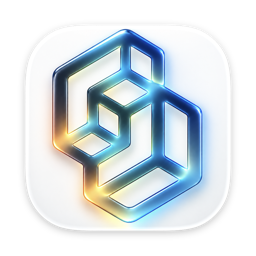
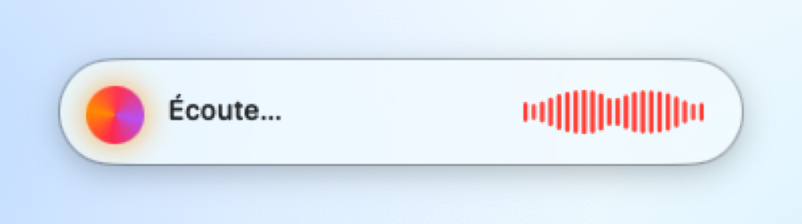
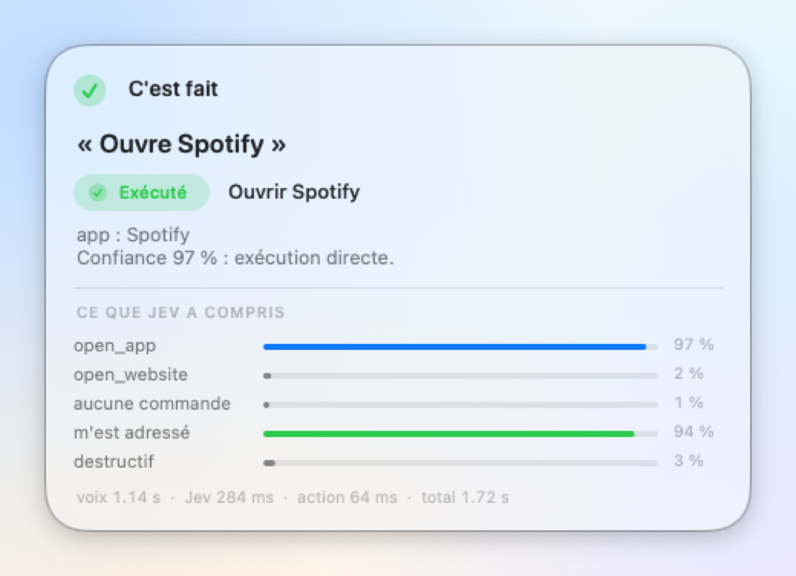
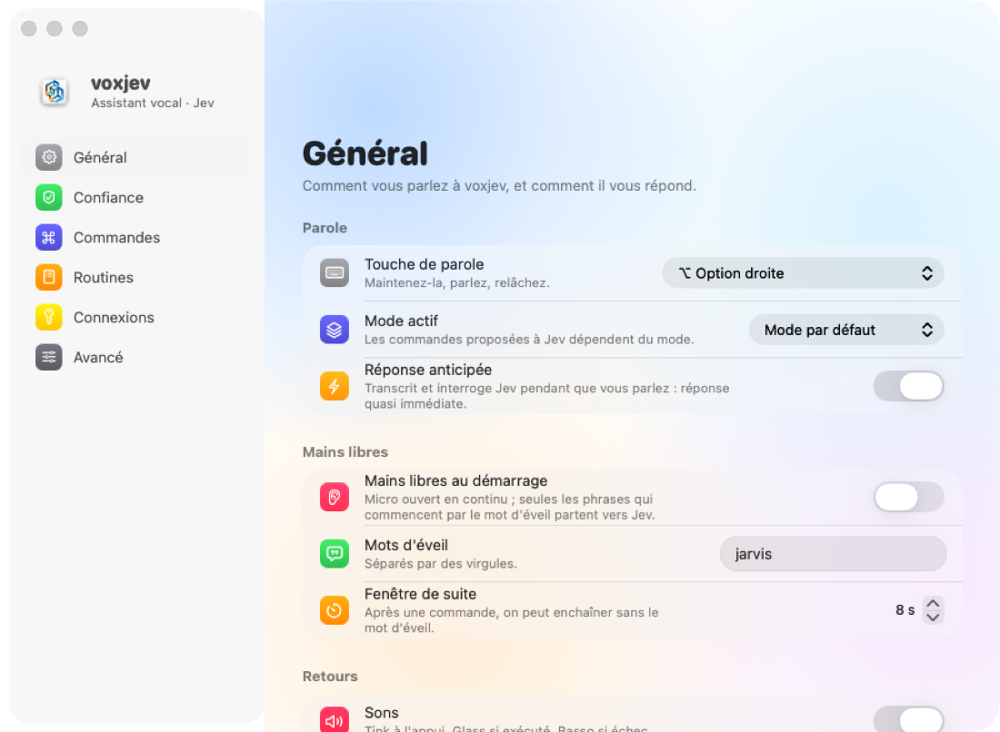
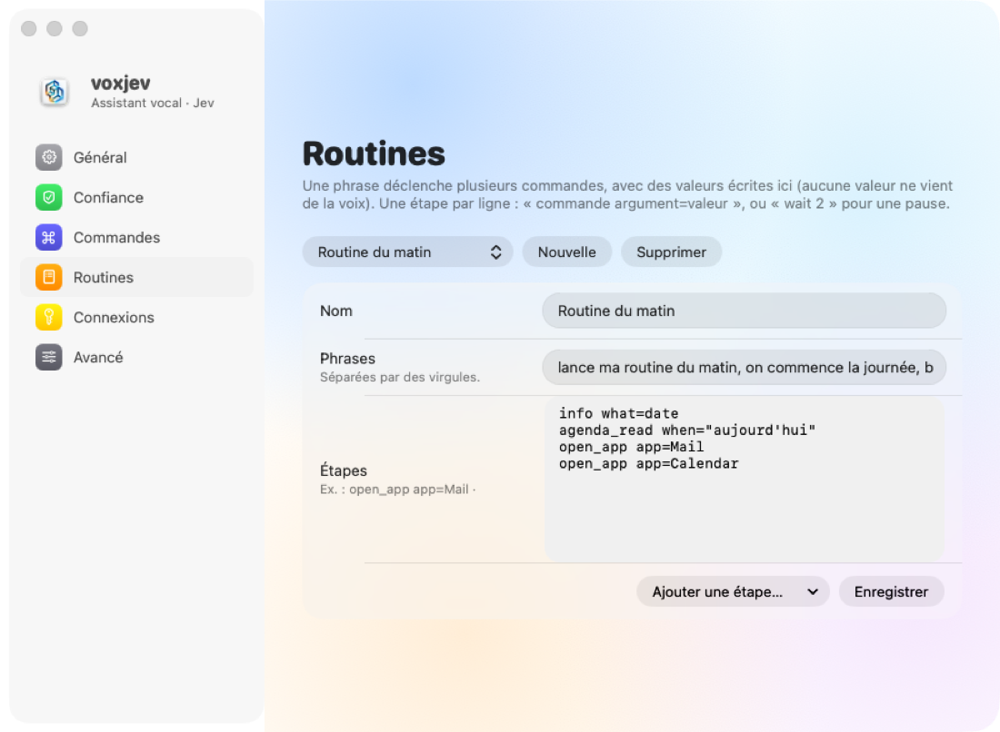

<div align="center">



# voxjev

**L'assistant vocal français pour macOS qui agit, sans jamais inventer.**

Maintenez une touche, parlez, relâchez : voxjev transcrit en local, comprend en ~300 ms
et agit dans vos apps : ouvrir, chercher, taper, planifier, cliquer dans un menu, lancer une routine…

[](#installation)
[](#installation)
[](pyproject.toml)
[](tests)
[](LICENSE)




</div>

---

## Pourquoi voxjev

La plupart des assistants vocaux font générer par un grand modèle ce qu'il faut exécuter. voxjev
prend le chemin inverse : **le modèle ne fait que choisir, le code exécute.**

- 🎙️ **Transcription 100 % locale** : Whisper tourne sur votre Mac (MLX, ~1,2 s). L'audio ne quitte jamais la machine.
- 🧠 **Décision par [Jev](https://docs.typesafe.ai)** (TypeSafe) : un seul appel par phrase, où toutes les questions sont posées en parallèle. Quelle commande ? Est-ce qu'on me parle ? Est-ce destructif ? Plusieurs actions ?
- 🎯 **« Sélectionner plutôt que générer »** : Jev choisit parmi des éléments *réels* (vos commandes, les menus de l'app ouverte, vos Raccourcis, les liens de la page, les mots de votre phrase). Il ne peut rien inventer.
- 🛡️ **Sûr par construction** : liste blanche d'actions, aucun shell, arguments extraits par du code, confirmation obligatoire pour tout ce qui est destructif.
- 🍎 **Natif macOS 26** : HUD et Réglages en Liquid Glass, barre des menus, symboles animés.

## Ce que vous pouvez dire

| Domaine | Exemples |
|---|---|
| **Apps et web** | « ouvre Spotify », « cherche la météo à Lyon », « mets du lofi sur YouTube » |
| **N'importe quelle app** | « exporte en PDF », « nouvelle fenêtre privée », « affiche la barre latérale » |
| **Page ouverte** | « clique sur le 2ᵉ lien », « ouvre le meilleur résultat », « ouvre celui du Routard » |
| **Clavier et saisie** | « tape bonjour à tous », « copie », « rouvre l'onglet fermé », « descends » |
| **Temps et agenda** | « minuteur 10 minutes pour les pâtes », « rappelle-moi d'appeler Paul demain à 18h », « qu'est-ce que j'ai demain ? » |
| **Notes et mails** | « note que je dois acheter des piles », « écris un mail à Paul pour lui dire que je serai en retard » (brouillon, jamais envoyé), « quels mails demandent une action ? » |
| **Fichiers et mémoire** | « ouvre le fichier rapport de stage », « retiens que mon dentiste c'est le Dr Martin », « c'est qui mon dentiste ? » |
| **Système** | « mode sombre », « plus de lumière », « coupe le wifi », « annule ça » |
| **Fenêtres** | « range les fenêtres », « mets cette fenêtre à gauche », « mets Chrome à gauche et Spotify à droite », « remets les fenêtres comme avant » ; chaque page ouverte par voxjev se range à côté de la fenêtre courante |
| **Plusieurs actions** | « ouvre Spotify, cherche Get Lucky puis lance-la » |
| **Tâches web et bureau** | « trouve-moi un vol Paris Lisbonne le 12 octobre » (agent qui s'arrête avant tout achat) |
| **Routines** | « lance ma routine du matin » : vos enchaînements, définis dans les Réglages |

Plus de 55 commandes, 3 modes (défaut, CTF / pentest, travail), et un mode **mains libres** :
« Jarvis, … », avec détection du mot d'éveil en local.

## Comment ça marche

```
⌥ droite maintenu ─► micro ─► Whisper local (MLX) ─► 1 requête Jev, questions en parallèle
                                                        • quelle commande ? (+ « aucune »)
                                                        • m'est-ce adressé ?  • destructif ?  • plusieurs actions ?
                                                        • quel menu / Raccourci / segment de phrase ?
                  ─► décision en code : exécuter · confirmer · ignorer
                  ─► arguments extraits en code (regex, dates, candidats réels) ─► actions en liste blanche
                  ─► HUD Liquid Glass + réponse lue à voix haute
```

Pendant que vous parlez, voxjev lit déjà les menus de l'app ouverte, prépare la connexion et
transcrit par anticipation. Si vous marquez une pause avant de relâcher, la réponse est quasi immédiate.

## Installation

**Prérequis** : Mac Apple Silicon, macOS 26 recommandé (fonctionne dès macOS 14),
[uv](https://docs.astral.sh/uv/), outils en ligne de commande Xcode (`xcode-select --install`),
une clé API [TypeSafe](https://docs.typesafe.ai).

```bash
git clone https://github.com/Crypt0nik/voxjev.git
cd voxjev
uv sync
echo 'TYPESAFE_API_KEY=votre_clé' > .env          # jamais commité
./voxjev --text "ouvre Spotify" --dry-run           # premier essai, sans micro
./scripts/install_app.sh --login                    # installe voxjev.app (+ lancement à la connexion)
```

Au premier lancement, autorisez **voxjev** dans *Réglages Système › Confidentialité et sécurité* :
**Accessibilité**, **Surveillance de l'entrée** et **Micro** (demandé au premier appui).
Le modèle Whisper (~1,5 Go) est téléchargé une seule fois.

> `install_app.sh` signe l'app avec un certificat local créé dans votre trousseau : macOS garde
> ainsi vos autorisations d'une mise à jour à l'autre.

**Optionnel** :

| Pour… | À faire |
|---|---|
| questions générales, brouillons rédigés, découpage avancé | `OPENROUTER_API_KEY` dans `.env` (~0,0002 $ par usage) |
| lancer un titre précis sur Spotify | une app sur developer.spotify.com, puis *Réglages › Connexions* |
| l'agent web | Chrome › `chrome://inspect/#remote-debugging` › *Allow remote debugging* |
| « clique sur le 2ᵉ lien » | selon votre navigateur, voir [Navigateurs pris en charge](#navigateurs-pris-en-charge) |
| Verr. Maj comme touche de parole | *Réglages › Avancé*, ou `./scripts/capslock.sh install` |

## Navigateurs pris en charge

« Clique sur le 2ᵉ lien », « ouvre le meilleur résultat » et « … puis ouvre le premier lien »
agissent sur le navigateur au premier plan, sinon sur votre navigateur par défaut. Les recherches
s'ouvrent dans un nouvel onglet de sa fenêtre principale.

| Navigateur | Lecture de la page | Réglage à faire une fois |
|---|---|---|
| **Arc** | AppleScript | aucun (macOS demande d'autoriser voxjev à contrôler Arc) |
| **Google Chrome** | protocole de débogage, sinon AppleScript | `chrome://inspect/#remote-debugging` › *Allow remote debugging*, puis *Allow* ; **ou** *Affichage › Options pour les développeurs › Autoriser JavaScript à partir des événements Apple* |
| **Brave**, **Edge** | AppleScript | *Autoriser JavaScript à partir des événements Apple* (menu Affichage / Développeur) |
| **Vivaldi** | AppleScript | autorisation d'automatisation macOS |
| **Safari** | AppleScript | *Développement › Autoriser le JavaScript depuis les événements Apple* |
| Firefox | non pris en charge (pas d'accès AppleScript aux pages) | — |

Le script qui lit la page est figé et en lecture seule ; seuls des liens `http(s)` présents sur la
page peuvent être ouverts, et les liens de compte, de connexion ou contenant un e-mail sont exclus.

## Réglages

Tout se règle dans une fenêtre native (menu › **Réglages…**, ⌘,) : touche de parole, mains
libres, voix, seuils de confiance, commandes actives, routines, clés API (jamais affichées),
autorisations. Chaque modification est validée puis appliquée à chaud.

<div align="center">


</div>

Les réglages personnels sont stockés à part (`~/Library/Application Support/voxjev/settings.yaml`) ;
`config/commands.yaml` décrit toutes les commandes et reste la référence.

## Confidentialité et sécurité

**Ce qui part vers l'API TypeSafe** : la phrase transcrite, le nom de l'app au premier plan, la
liste de vos apps, les intitulés de menus et noms de Raccourcis proposés comme choix. D'autres
éléments ne partent que quand vous les demandez explicitement : noms des fichiers candidats,
souvenirs enregistrés, extraits de mails non lus, liens de la page ouverte.

**Ce qui ne part jamais** : l'audio, l'agenda (lu localement), le contenu des fichiers, les phrases
sans mot d'éveil en mode mains libres, le journal local, les liens de compte ou contenant un e-mail.

**Garanties** :
- aucune chaîne venue du modèle ou de la voix n'est exécutée ;
- aucun shell ; scripts AppleScript figés, valeurs passées en `argv` ;
- un texte dicté n'est jamais tapé dans un terminal ;
- les mails ne sont jamais envoyés, les agents s'arrêtent avant tout achat, paiement ou envoi ;
- tout ce qui est destructif (corbeille, quitter une app, menu « Supprimer ») est confirmé.

Le détail complet est dans le [guide](docs/GUIDE.md#données-envoyées-à-lapi-typesafe).

## Qualité

```bash
uv run pytest          # 106 tests, 100 % hors ligne (faux client Jev)
./voxjev --eval        # jeu de 175 phrases, dont des phrases proches qui ne doivent PAS déclencher
```

| Mesure | Résultat |
|---|---|
| Exactitude globale | **97,7 %** (175 phrases) |
| Exécutions par erreur | **0** (les rares faux positifs passent par une confirmation) |
| Latence Jev | p50 ~300 ms |
| Coût | ~0,0003 $ par phrase (environ 1 $/mois pour 100 commandes par jour) |

## Architecture

```
config/commands.yaml    commandes, modes, routines (données, liste blanche)
src/voxjev/
  pipeline.py           contexte → Jev → décision → arguments → étapes
  jev_client.py         client Jev (un appel, questions en parallèle) + faux client pour les tests
  decide.py · args.py   règles de décision, extraction déterministe des arguments
  actions.py            config → étapes argv (liste blanche) · executor.py : exécution
  candidates.py         candidats réels : menus, Raccourcis, segments de phrase
  hud.py · gui.py       HUD Liquid Glass, barre des menus, moteur
  settings.py           fenêtre Réglages
  when.py               dates et durées en français
  chrome.py · webagent.py · desktop.py   page ouverte, agent web, agent bureau
scripts/                voxjev.app (lanceur Objective-C, Python embarqué), démo du HUD
tests/                  106 tests hors ligne
```

## Feuille de route

- [ ] Sortie en paquet signé et notarisé (installation sans terminal)
- [ ] Commandes de menus et de pages en anglais
- [ ] Contexte d'écran optionnel (ce que je regarde)

## Remerciements

- [TypeSafe / Jev](https://docs.typesafe.ai), la couche de décision.
- [mlx-whisper](https://github.com/ml-explore/mlx-examples), la transcription locale sur Apple Silicon.
- [jev-ultrafast](https://github.com/browser-use/jev-ultrafast) (Browser Use), l'agent web.
- Idées inspirées de projets open source de la communauté Jev (MIT) : menus de n'importe quelle
  app ([dwim](https://github.com/rohit9mehta/dwim)), sélection plutôt que génération, mot d'éveil et
  agent bureau ([jev-voice](https://github.com/kevinbadi/jev-voice)), tri des mails
  ([jev-mail](https://github.com/vynnlee/jev-mail)). Détails dans [docs/ecosysteme-jev.md](docs/ecosysteme-jev.md).

## Licence

[MIT](LICENSE)
